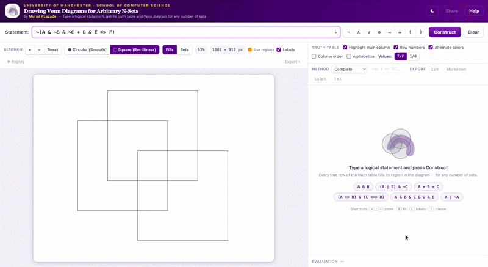

# Drawing Venn Diagrams for Arbitrary N-Sets

[](https://github.com/rzazademurad/venn-diagrams/actions/workflows/ci.yml)
[](LICENSE)

An in-browser propositional logic compiler and Venn diagram generator capable
of drawing and filling exact diagrams for **any** number of sets ($N \ge 1$).

- **Live demo:** https://rzazademurad.github.io/venn-diagrams/
- **Paper:** [Drawing Venn Diagrams for Arbitrary N-Sets — 2016 dissertation (PDF)](docs/Murad.Rzazade_Drawing_Venn_Diagrams.pdf)
- **Video:** [original 2016 demo on YouTube](https://www.youtube.com/watch?v=raVwdW5XCQ0)

<sub>// the video shows the original Java build from 2016 — this repo is its TypeScript successor</sub>



## The Problem and the Algorithm

Standard Venn diagram tools max out at 3 circles or use fixed static templates
for 4 to 6 sets. Circles physically cannot represent 4 or more sets because
$N$ circles intersect in at most $N^2 - N + 2$ regions (yielding only 14
regions instead of the necessary $2^4 = 16$).

While John Venn theoretically showed in 1880 that serpentine curves could
double the regions inductively, no practical programmatic implementation
existed online to dynamically generate and fill these diagrams for arbitrary
$N$.

In 2016, as part of my undergraduate dissertation at the University of
Manchester, I developed the algorithmic solution to make arbitrary $N$-set
generation computational:

1. **Deterministic Serpentine State Machine:** Programmatically routes the
   $k$-th set boundary through every existing partition, doubling the region
   count at each step without topological collapse.
2. **Quadrant-Folding Mapping Algorithm (`Mapper.ts`):** A custom bijection
   that maps every minterm row from the truth table directly to the interior
   seed pixel of its corresponding geometric region, enabling instant,
   leak-free flood filling and reverse hover-lookup.

I have open-sourced this work to provide a reference implementation for
computational geometry, discrete mathematics, and logic visualization.

## Features

- **Dual Construction Engines:** Switch live between the original rectilinear
  serpentine engine and a smooth circular/annular engine.
- **Logic Compiler:** Dijkstra Shunting-Yard AST parser supporting all
  standard propositional operators.
- **Off-Thread Web Worker:** Heavy rendering and iterative 32-bit
  flood-filling run off the main thread to keep the interface fast.
- **Tiled High-DPI Canvas:** Bypasses browser canvas size limitations when
  rendering complex multi-set diagrams.
- **Exports:** Export vector SVG, high-res PNG, or raw truth tables
  (CSV, Markdown, LaTeX).

## Quickstart

```bash
git clone https://github.com/rzazademurad/venn-diagrams.git
cd venn-diagrams
npm install

npm run dev        # Local dev server (http://localhost:5173)
npm test           # 213-assertion test suite
npm run build      # Production build
```

Requires Node 20+.

## Formula Syntax

Propositions `A`–`Z`, constants `1` (universal set) and `0` (empty set),
parentheses, and the following operators. Input is case-insensitive.

| Operator | Type | Precedence | Associativity |
| --- | --- | --- | --- |
| `~`, `!` | Negation ($\neg$) | 6 | Right |
| `&`, `^` | Conjunction ($\land$) | 5 | Left |
| `\|` | Disjunction ($\lor$) | 4 | Left |
| `=>`, `->` | Conditional ($\rightarrow$) | 3 | Right |
| `+` | Exclusive OR ($\oplus$) | 2 | Left |
| `<=>`, `<->` | Biconditional ($\leftrightarrow$) | 2 | Left |

## Academic Background & Attribution

This project is a modern TypeScript re-implementation and extension of:

- **Murad Rzazade** (2016). *Drawing Venn Diagrams for Arbitrary N-Sets.*
  BSc Project Report, School of Computer Science, University of Manchester.
  Supervised by Dr. Ian Pratt-Hartmann.
  [Report PDF](docs/Murad.Rzazade_Drawing_Venn_Diagrams.pdf) ·
  [Original 2016 Demo](https://www.youtube.com/watch?v=raVwdW5XCQ0)
- **Brian S. Borowski** (2011). *Truth Table Constructor.* Parsing routines
  and error-offset semantics.

## License

MIT © 2016–2026 Murad Rzazade
