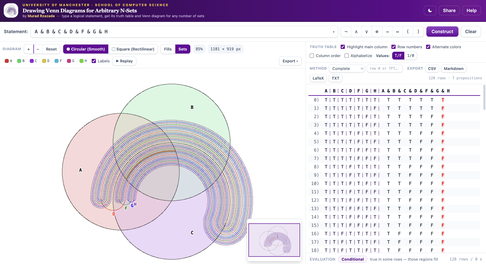

# Drawing Venn Diagrams for Arbitrary N-Sets

[](https://github.com/rzazademurad/venn-diagrams/actions/workflows/ci.yml)
[](LICENSE)

Type a propositional formula and get its truth table and Venn diagram, for any
number of sets. Runs entirely in the browser; the only runtime dependencies
are react and react-dom.

Classical circles cannot construct Venn diagrams for $N \ge 4$ sets because
$N$ circles produce at most $N^2 - N + 2$ regions (14 regions for 4 circles,
failing the required $2^4 = 16$). This project implements John Venn's
inductive serpentine construction to generate and fill all $2^N$ regions for
arbitrary $N$ — see [Why circles are not enough](#why-circles-are-not-enough).

**Live demo:** https://rzazademurad.github.io/venn-diagrams/



## Usage

```bash
npm install
npm run dev        # dev server at http://localhost:5173
npm test           # parity test suite (Node, no browser needed)
npm run build      # type-check + production build to dist/
```

Other scripts: `preview`, `test:watch`, `bench`, `e2e`, `build:single`
(self-contained single-file build). Requires Node 20 or later.

### Formula syntax

Propositions `A`–`Z`, constants `1` (universal set) and `0` (empty set),
parentheses, and the following operators. Input is case-insensitive and
reformatted canonically (`a&b` becomes `A & B`).

| Operator | Meaning | Precedence |
| --- | --- | --- |
| `~` `!` | negation | 6 |
| `&` `^` | conjunction | 5 |
| `\|` | disjunction | 4 |
| `=>` `->` | conditional (right-assoc.) | 3 |
| `+` | exclusive or | 2 |
| `<=>` `<->` | biconditional | 2 |

Note that `+` and `<=>` bind below the conditional, so `A + B => C` parses as
`A + (B => C)`. This matches the reference implementation, which the test
suite checks against.

## Why circles are not enough

A Venn diagram on N sets must show all 2^N intersection regions. Two circles
intersect in at most two points, which limits N circles to N² − N + 2
regions; at N = 4 that gives 14 < 16, so no arrangement of four circles is a
Venn diagram.

The construction used here is Venn's inductive one: start from the
three-circle diagram, then add each set as a closed serpentine loop that
bisects every existing region, doubling the region count. This works for
every N. The project implements the induction twice:

| Engine | Approach | Source |
| --- | --- | --- |
| Smooth (circular) | Three circles on an equilateral trefoil; set 4 is a cut annulus around circle 3; further sets are bands of half the previous gap with semicircular caps. Region membership is computed analytically. | `src/geometry/SmoothConstruction.ts` |
| Rectilinear | Squares plus serpentine loops traced by a directional state machine, displacement halving per curve. Compact at high N; same geometry as the original 2016 implementation. | `src/geometry/VennsConstruction.ts` |

Both engines fill the same regions from the same truth table.

## Implementation notes

- `src/logic/` — scanner and shunting-yard parser with character-offset
  error reporting, plus the truth-table evaluator.
- `src/geometry/Mapper.ts` — maps truth-table rows to diagram regions.
  Boundary points left by the last serpentine loop are projected into seed
  points, grouped by quadrant, and folded log₂ M times; index i of the result
  is the interior pixel of the region for row i. The same map is used in
  reverse for hover-to-minterm lookup.
- `src/worker/` — all construction, mapping and filling runs in a Web
  Worker, so the UI stays responsive and jobs can be cancelled.
- `src/renderer/` — iterative (explicit-stack) flood fill over a
  Uint32Array view; tiled canvas rendering, since browsers blank a single
  canvas above roughly 268 Mpx; zooming re-runs the construction on a larger
  buffer so curves stay one pixel wide.

Features: two view modes (fills / per-set tinting), construction replay,
virtualized truth table with search, PNG and SVG export, table export to
CSV/Markdown/LaTeX/text, shareable URLs, dark mode, keyboard access.

## Project structure

```
src/
├── logic/         Scanner, Parser, TruthTable, tokens, exceptions
├── geometry/      SmoothConstruction, VennsConstruction, Mapper
├── renderer/      Raster, FloodFill, CanvasRenderer, overlays
├── worker/        vennWorker
├── app/           MainInterface, analyze, DiagramMirror, snapshot, share
├── exports/       CSV / Markdown / LaTeX / text / PNG / SVG export
├── hooks/         useVennWorker, useViewport, useTheme, useShareLink
└── components/    FormulaBar, VennCanvas, TruthTablePanel, HelpModal, ...
scripts/           test runner, benchmarks, E2E checks, single-file packer
docs/              the 2016 project report (PDF)
```

## Testing

`npm test` runs 213 assertions checking parity with the reference engine:
scanner error offsets, postfix output, truth-table rows, geometry for both
engines up to N = 7, auto-zoom at N = 10, flood-fill invariants and export
samples. `npm run e2e` drives the production build in headless Chromium with
zero tolerated console errors.

## Background

This is a TypeScript re-implementation and extension of my 2016 BSc project:

> Murad Rzazade, *Drawing Venn Diagrams for Arbitrary N-Sets*. BSc Project
> Report, School of Computer Science, University of Manchester, 2016.
> Supervised by Dr. Ian Pratt-Hartmann.
> [Report (PDF)](docs/Murad.Rzazade_Drawing_Venn_Diagrams.pdf) ·
> [demo video of the original](https://www.youtube.com/watch?v=raVwdW5XCQ0)

The truth-table routines derive from Brian S. Borowski's open-source *Truth
Table Constructor* (2011, brian-borowski.com), which the 2016 project built
on. This port adds the smooth circular engine, the Web Worker and tiled-canvas
architecture, and the interactive analysis layer. The inductive construction
itself is John Venn's.

## License

[MIT](LICENSE) © 2016–2026 Murad Rzazade
